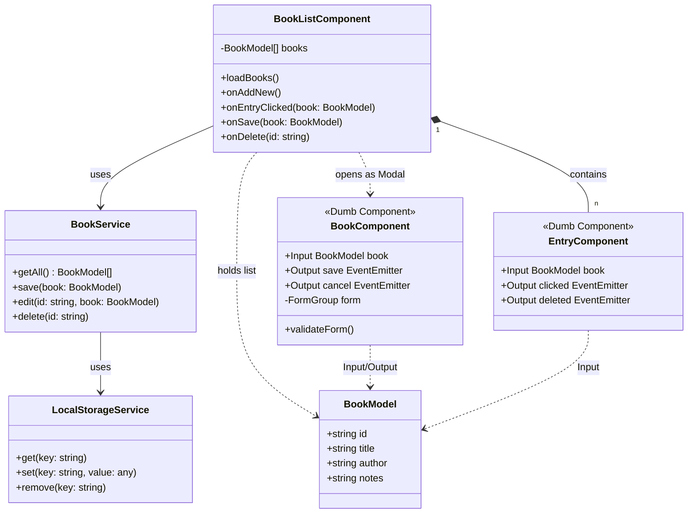

# BookNote

Eine mobile App (Android/iOS) zum Erfassen gelesener Bücher mit Titel, Autor und Notizen. Gebaut mit Angular + Ionic Framework.

## Architektur

### Technologie-Entscheidungen
- **Angular + Ionic**: Hybrid-App im WebView, eine Codebase für Android und iOS
- **Ionic Preferences (Key-Value Storage)**: Lokale Datenpersistenz auf dem Gerät
- **Smart/Dumb Component Pattern**: `BookListComponent` als Controller, Formular und Listenelement als zustandslose Komponenten

### Komponentendiagramm



### Komponentenbeschreibungen

**`BookListComponent`** - Smart Component / Controller
Lädt alle Bücher beim Start, orchestriert alle Aktionen (Add, Edit, Delete), empfängt Events von Child-Komponenten und delegiert an den `BookService`.

**`EntryComponent`** - Dumb Component
Zeigt einen einzelnen Bucheintrag an, unterstützt Swipe-Delete (`ion-item-sliding`), gibt Klick- und Delete-Events nach oben weiter - kennt keine Services.

**`BookComponent`** - Dumb Component
Reaktives Formular für Titel, Autor und Notiz. Funktioniert für neu Erstellen und Bearbeiten (je nach übergebenem Input). Gibt nur Events zurück - kennt keine Services.

**`BookService`** - Facade
Einzige Schnittstelle für Komponenten zur Datenhaltung. Enthält die Geschäftslogik (z.B. ID-Generierung beim Speichern).

**`LocalStorageService`** - Infrastruktur
Kapselt den direkten Zugriff auf den Ionic Preferences/Storage. Kennt keine fachlichen Konzepte.

---

This project was generated using [Angular CLI](https://github.com/angular/angular-cli) version 21.1.1.

## Development server

To start a local development server, run:

```bash
ng serve
```

Once the server is running, open your browser and navigate to `http://localhost:4200/`. The application will automatically reload whenever you modify any of the source files.

## Code scaffolding

Angular CLI includes powerful code scaffolding tools. To generate a new component, run:

```bash
ng generate component component-name
```

For a complete list of available schematics (such as `components`, `directives`, or `pipes`), run:

```bash
ng generate --help
```

## Building

To build the project run:

```bash
ng build
```

This will compile your project and store the build artifacts in the `dist/` directory. By default, the production build optimizes your application for performance and speed.

## Running unit tests

To execute unit tests with the [Vitest](https://vitest.dev/) test runner, use the following command:

```bash
ng test
```

## Running end-to-end tests

For end-to-end (e2e) testing, run:

```bash
ng e2e
```

Angular CLI does not come with an end-to-end testing framework by default. You can choose one that suits your needs.

## Additional Resources

For more information on using the Angular CLI, including detailed command references, visit the [Angular CLI Overview and Command Reference](https://angular.dev/tools/cli) page.
